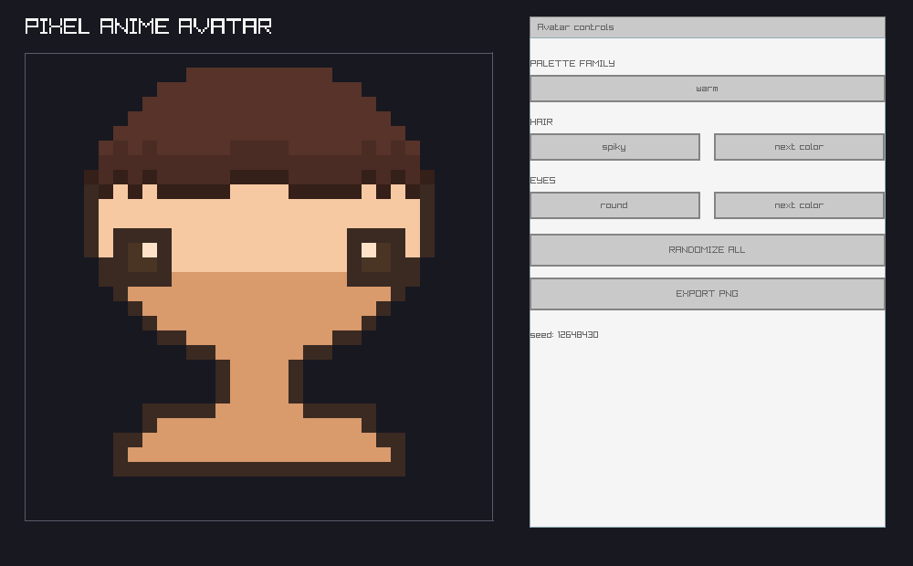
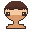

# Pixel Anime Avatar Generator

A small C++ desktop app that procedurally generates 32x32 pixel-art anime-style
avatars, with a live customizer UI for hair, eyes, and palette. Built for fun /
vibe coding — not a serious engineering project, optimize for "looks cool fast"
over architectural purity. I am currently in my agentic ai prompt slop code boom era 
and wanted to test how much I can do just by proompting my way through. If you are 
a HR person and see this, hii!! Overall this is fun but this project is really tiny
and I am surprised how much the combination of Opus 5 as planer and gpt 5.4 luna and 
Muse Spark 1.2 can do. I mostly one-shot everything.

## Results

The finished app combines a chunky, nearest-neighbor pixel preview with a compact
control panel for live avatar changes:



Representative procedural avatar exports:

<p>
  
  
  
</p>

The v1 verification pass confirmed that the app builds from a clean CMake
configuration, renders a scaled 32x32 canvas, produces distinct mirrored hair and
eye variants, keeps palette combinations coherent, supports randomize-all, and
exports valid unscaled 32x32 PNG files.

## Goals
- Procedurally generate a chibi/anime-style pixel avatar face from rules, not
  premade art assets.
- Let the user tweak hair style, eye style, mouth style, and palette live via
  UI controls and immediately see the result.
- Export the current avatar as a PNG.

## Non-goals (v1)

- No face shape or accessory customization yet (hair, eyes, mouth, and palette
  only).
- No animation and no full-body sprites — the avatar is a single static face.
- No networking, no asset packs, no sprite sheets from external artists.

## Tech Stack

- **Language:** C++17
- **Graphics/windowing:** raylib
- **Build:** CMake (single executable target)
- **Output format:** 32x32 pixel canvas, rendered scaled-up (e.g. 8x-16x) in
  the window so pixels are chunky and visible; exported PNG is the raw 32x32
  (not the scaled-up version).

## Build

Use a Visual Studio 2022 x64 developer shell, then run:

```text
cmake -B build -G Ninja
cmake --build build
```

Run `build/pixel_anime_visualizer.exe`. PNG exports are written to `exports/`.

## Sprite Spec

- **Canvas size:** 32x32 pixels.
- **Symmetry:** Strict left-right mirror. Only the left half (columns 0-15) is
  ever computed by generation rules; column 16-31 is a mirrored copy. This
  keeps every generated face structurally valid by construction.
- **Generation approach:** Fully procedural / rule-based pixel placement — no
  premade sprite/asset library. Hair and eyes are drawn by small deterministic
  or randomized algorithms (e.g. hair = randomized silhouette within allowed
  bounding region + fixed base shading rule; eyes and mouth = small
  parametrized shapes drawn at fixed socket positions).
- **Palette:** Fixed, curated anime-style palette(s) baked into the program
  (skin tones, hair colors, eye colors chosen to look coherent together —
  not arbitrary RGB). A "randomize" action picks a valid combination from
  this palette, it never generates arbitrary/chaotic RGB values.

## Customizable Parameters (v1 scope)

1. **Hair** — style/silhouette (a small enumerated set of procedural hair
   shapes) + hair color (from the curated palette).
2. **Eyes** — style/shape (a small enumerated set of procedural eye shapes)
   + eye color (from the curated palette).
3. **Palette** — overall color scheme selection (skin tone + which curated
   palette family hair/eye colors are drawn from).
4. **Mouth** — style/shape (a small enumerated set of procedural mouth
   shapes), drawn in the family's outline tone on the chin.

Everything else (face shape, accessories) is explicitly out of scope for v1 and
can be added later.

## Interaction Loop

- App opens with a live preview window showing the current avatar, scaled up
  large enough to see individual pixels clearly.
- UI controls (buttons/sliders — exact widget choice left to implementation,
  raylib immediate-mode GUI or similar) let the user:
  - Cycle/select hair style and hair color
  - Cycle/select eye style and eye color
  - Cycle/select mouth style
  - Cycle/select palette family
  - Trigger "randomize all" for a full reroll
  - Trigger "export PNG" to save the current avatar to disk
- Every change updates the preview immediately (no separate "apply" step).
- The last avatar is saved to `avatar.ini` (next to the exe) on exit and
  reloaded on the next launch, so the app remembers where you left off.

## Out of Scope / Explicitly Deferred Ideas (for later, not v1)

- Face shape, blush, glasses, earrings, other accessories
- Full color randomization outside the curated palette
- Any animation or multiple expression states
- Any asset-based (non-procedural) generation

## Definition of Done (v1)

- [x] App builds and runs via CMake with raylib
- [x] 32x32 canvas renders scaled up in a window
- [x] Hair generation is procedural, has at least 2-3 distinct styles, mirrors
      correctly across the vertical axis
- [x] Eyes generation is procedural, has at least 2-3 distinct styles, mirrors
      correctly across the vertical axis
- [x] Palette selection works and always produces coherent (non-chaotic)
      color combinations
- [x] "Randomize all" button works
- [x] "Export PNG" saves the current 32x32 avatar (unscaled) to disk as a
      valid PNG file
